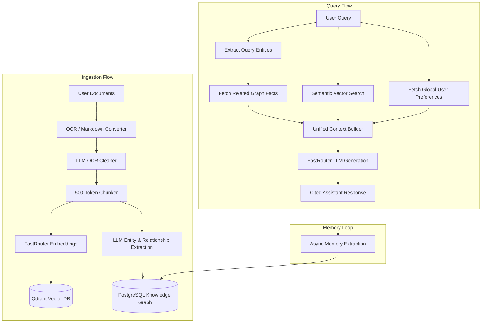

# AutoMem — The Intelligent Academic Assistant 🧠

**AutoMem** is a next-generation Retrieval-Augmented Generation (RAG) system specifically re-engineered as a **Student Academic Assistant**. Unlike traditional RAG, AutoMem doesn't just read documents—it *builds a brain*.

By combining **Semantic Vector Search** (Qdrant) with a persistent **PostgreSQL Knowledge Graph**, AutoMem extracts structured relationships from your documents and remembers your personal preferences across every chat session.

---

## 🏗️ AutoMem Architecture

AutoMem follows a hybrid retrieval strategy: **Vector + Graph**.



---

## 🌟 Key AutoMem Features

### 1. Persistent Knowledge Graph (The "Brain")
Every document you upload is parsed for entities and relationships (e.g., `DNA` → `is_structured_as` → `Double Helix`). These facts are stored in PostgreSQL and injected into your chat context whenever relevant entities are mentioned.

### 2. Global User Memory (Self-Learning)
AutoMem listens to you. If you mention "I am a medical student" or "I prefer bullet points," the system extracts these as **User Facts**. This memory is **Global**—the assistant will remember who you are even if you start a brand-new chat session.

### 3. Academic Persona System
Organize your university life with specialized processing pipelines:
- **Research Papers**: Prioritizes findings, methodology, and citation accuracy.
- **Lecture Notes**: Focuses on definitions, formulas, and conceptual hierarchy.
- **Assignments**: Tracks rubrics, deadlines, and grading criteria.

### 4. Interactive Brain Visualizer
Click the **"🌌 View Global Memory Graph"** in the sidebar to see a live, interactive 3D simulation of your computer's "mind." Watch how different documents connect through shared concepts and see exactly what the system has learned about you.

### 5. Memory Management (Clear Brain)
Need a fresh start? Use the **🗑️ Clear Global Memory** button to wipe all learned facts and document relationships while keeping your source files intact.

---

## 🛠️ Tech Stack & Integration

| Component | Technology | Role |
|-----------|-----------|------|
| **Core API** | FastAPI | High-performance backend routing |
| **Frontend** | Streamlit | Modern, interactive user interface |
| **Intelligence** | [FastRouter](https://fastrouter.ai) | Unified LLM gateway (Claude 3.5, GPT-4, Gemini) |
| **Vector DB** | Qdrant | Fast semantic similarity search |
| **Graph DB** | PostgreSQL | Persistent entity-relationship storage |
| **Task Queue** | Celery + Redis | Asynchronous OCR and memory extraction |
| **Parsing** | ocrmypdf + spaCy | Document extraction and NLP processing |

---

## 🚀 Getting Started

1. **Configure Environment**:
   ```bash
   cp env_example .env
   # Set your FASTROUTER_API_KEY and APP_API_KEY
   ```

2. **Deploy with Docker**:
   ```bash
   docker compose up -d --build
   ```

3. **Access the Hub**:
   - **Streamlit App**: `http://localhost:8501`
   - **API Docs**: `http://localhost:8000/api/docs`

---

## 🔍 How to Test the Intelligence

1. **Upload a Paper**: Upload an academic PDF. Select the `research_papers` category.
2. **State a Preference**: Tell the bot: *"I am an engineering student, please explain concepts using physics analogies."*
3. **Check the Graph**: Open the Global Memory Graph to see your "student status" saved as a node.
4. **New Chat Verification**: Start a new chat session and ask: *"How should you explain things to me?"* Output should confirm it remembers your engineering background and physics preference.

---

## 📜 API Documentation
For detailed endpoint specifications (Processing, Chat, Prompts, Memory), refer to [**api_docs.md**](./api_docs.md).

